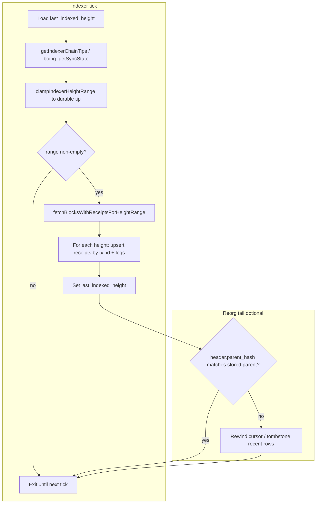

# Indexer: receipt and log ingestion (I1–I3)

**Roadmap:** [BOING-VM-CAPABILITY-PARITY-ROADMAP.md](BOING-VM-CAPABILITY-PARITY-ROADMAP.md) tracks **I1** (this spec), **I2** (`boing_getLogs`), **I3** (`boing-sdk` helpers).

This spec is for **off-chain indexers** (Workers, daemons, explorer backends) that want **strong** visibility into **execution results** and **events**. The **canonical replay path** remains **blocks + receipts**; **`boing_getLogs`** is an optional, bounded shortcut (see below).

Before wiring a long-running indexer, a quick **RPC smoke** (height + optional sync state) from **`examples/native-boing-tutorial`**: **`npm run preflight-rpc`** with **`BOING_RPC_URL`** — [PRE-VIBEMINER-NODE-COMMANDS.md](PRE-VIBEMINER-NODE-COMMANDS.md).

---

## RPC sources

| Method | Use |
|--------|-----|
| `boing_chainHeight` | Tip height |
| `boing_getSyncState` | **`head_height`**, **`finalized_height`**, **`latest_block_hash`** — use **`finalized_height`** (or SDK **`getIndexerChainTips` → `durableIndexThrough`**) when you only want to index behind a finalized bound ([RPC-API-SPEC.md](RPC-API-SPEC.md)) |
| `boing_getBlockByHeight(height, true)` | Block + aligned **`receipts[]`** (same order as `transactions`) — **primary** source for full history and idempotent upserts |
| `boing_getTransactionReceipt(tx_id)` | Single receipt when you already know **`tx_id`** (32-byte hex, BLAKE3 tx id) |
| `boing_getLogs` | **Optional:** filtered log rows across up to **128** inclusive heights and **2048** rows per call ([RPC-API-SPEC.md](RPC-API-SPEC.md)); use for targeted backfill, debugging, or thin pipelines — **not** a replacement for full block replay at scale |

Receipt shape (see [RPC-API-SPEC.md](RPC-API-SPEC.md)):

```json
{
  "tx_id": "0x...",
  "block_height": 123,
  "tx_index": 0,
  "success": true,
  "gas_used": 21000,
  "return_data": "0x",
  "logs": [{ "topics": ["0x..."], "data": "0x" }],
  "error": null
}
```

- **`logs`:** Boing VM **`LOG0`–`LOG4`** — topics are 32-byte words hex; `data` is arbitrary hex (bounded per protocol).

---

## Ingestion loop (recommended)

1. Persist **`last_indexed_height`** (and optional **`last_indexed_hash`** for reorg detection).
2. Each tick: `H = boing_chainHeight`. For `h` in `(last_indexed_height, H]`:
   - Fetch `boing_getBlockByHeight(h, true)`.
   - If `receipts[i]` is non-null, **upsert** by **`tx_id`** primary key with block metadata.
   - If `null` (old node / missing file), optionally skip or backfill later.
3. **Idempotency:** `INSERT OR REPLACE` / `ON CONFLICT(tx_id) DO UPDATE` on **`tx_id`**.

---

## SDK-assisted ingestion tick (pseudo-flow)

Use this when you implement the loop in **TypeScript** with **`boing-sdk`** (same semantics as the numbered loop above). Runnable demo: [examples/native-boing-tutorial/scripts/fetch-blocks-range.mjs](../examples/native-boing-tutorial/scripts/fetch-blocks-range.mjs) (`npm run fetch-blocks-range`). Use **`--verbose`** or **`BOING_VERBOSE=1`** for a bounded **`tx_id`** sample from **`receipts`** (see tutorial README).

```ts
import {
  createClient,
  getIndexerChainTips,
  clampIndexerHeightRange,
  fetchBlocksWithReceiptsForHeightRange,
} from 'boing-sdk';

async function indexerTick(rpcUrl: string, db: { getLastIndexedHeight(): Promise<number>; setLastIndexedHeight(h: number): Promise<void> }) {
  const client = createClient(rpcUrl);

  // 1) Load cursor from your DB (example)
  const lastIndexed = await db.getLastIndexedHeight();

  // 2) Tip + durable bound (single RPC)
  const tips = await getIndexerChainTips(client);
  const nextFrom = lastIndexed + 1;
  const clamped = clampIndexerHeightRange(nextFrom, tips.headHeight, tips.durableIndexThrough);
  if (clamped == null) {
    return; // nothing to index yet, or cursor already past durable tip
  }

  // 3) Fetch full blocks + receipts (sorted by height; tune maxConcurrent for your RPC)
  const bundles = await fetchBlocksWithReceiptsForHeightRange(
    client,
    clamped.fromHeight,
    clamped.toHeight,
    { maxConcurrent: 1, onMissingBlock: 'throw' } // or 'omit' if you tolerate pruned gaps
  );

  // 4) For each bundle: walk block.transactions[i] + block.receipts?.[i], upsert by tx_id, denormalize logs
  for (const { height, block } of bundles) {
    void height;
    void block;
    // your persistence + log tables
  }

  // 5) Advance cursor to clamped.toHeight (and optionally store block hash for reorg checks)
  await db.setLastIndexedHeight(clamped.toHeight);
}
```

**SDK helper:** **`planIndexerCatchUp(client, lastIndexedHeight, { maxBlocksPerTick? })`** (and **`planIndexerChainTipsWithFallback`**) in **`boing-sdk`** **`indexerSync.ts`** combine **`getIndexerChainTips`** with a **`boing_getSyncState`** → **`boing_chainHeight`** + tip block fallback on **-32601**, then apply **`clampIndexerHeightRange`**. Tutorial: **`npm run indexer-ingest-tick`** in [examples/native-boing-tutorial](../examples/native-boing-tutorial/) (plan-only by default; set **`BOING_FETCH=1`** to call **`fetchBlocksWithReceiptsForHeightRange`**).

**Notes:** Replace **`onMissingBlock: 'throw'`** with **`'omit'`** only if you explicitly handle gaps (e.g. pruned archive). For **events-only** backfill, **`getLogsChunked`** remains a bounded alternative; see **Log indexing** below. See also [NEXT-STEPS-FUTURE-WORK.md](NEXT-STEPS-FUTURE-WORK.md) for product-scale follow-ups (hosted observer, ops).

---

## Log indexing

- **Denormalize** logs into a child table: `(tx_id, log_index, topic0, topic1, …, data, block_height, contract_id)`.
- **Topic0** convention: many systems use a **discriminant** word; Boing has no enforced ABI—index **raw** topics and decode in app-specific workers (AMM, NFT). For the **MVP native constant-product pool**, filter **`boing_getLogs`** / receipt logs by pool **`address`** and parse **`Log2`** with **`tryParseNativeAmmLog2`** / **`filterMapNativeAmmRpcLogs`** (`boing-sdk` **`nativeAmmLogs.ts`**); tutorial **`npm run fetch-native-amm-logs`** ([examples/native-boing-tutorial](../examples/native-boing-tutorial/)).
- **Contract id for logs:** When ingesting from **`boing_getBlockByHeight(…, true)`** or **`boing_getTransactionReceipt`**, derive the emitting contract from the **parent transaction** (`ContractCall.contract`, or deploy-derived / salt-derived address for deploy payloads). Rows from **`boing_getLogs`** include an **`address`** field when the node can attribute the log (same rules); use it to skip payload decoding for those rows.
- **SDK:** Normalization and receipt-only helpers live in **`boing-sdk`** (`receiptLogs.ts`, `BoingClient.getLogs`); **`probeBoingRpcCapabilities`** / **`npm run probe-rpc`** ( **`boing-sdk`** or repo root, after SDK build) to detect missing **`boing_getSyncState`** / **`boing_getLogs`** (-32601) before backfill; **`indexerSync.ts`**: **`getIndexerChainTips`**, **`clampIndexerHeightRange`**, **`planIndexerChainTipsWithFallback`**, **`planIndexerCatchUp`**; wide height ranges can use **`getLogsChunked` / `planLogBlockChunks`** (`indexerBatch.ts`, default 128-block spans; optional **`maxConcurrent`** when your RPC tier allows parallel `boing_getLogs`); **block+replay backfill** can use **`fetchBlocksWithReceiptsForHeightRange`** (full block + `receipts`) or **`fetchReceiptsForHeightRange`** (receipts only; optional **`maxConcurrent`**; sorted by height) — see [BOING-VM-CAPABILITY-PARITY-ROADMAP.md](BOING-VM-CAPABILITY-PARITY-ROADMAP.md) **I3**.

---

## Reorgs

- Until the node exposes **finalized** height semantics ([RPC-API-SPEC.md](RPC-API-SPEC.md) / `boing_getSyncState`), indexers should:
  - Prefer **`finalized_height`** when available for **durable** index; or
  - Keep a **short** tail window and **rewind** if `parent_hash` breaks the chain.

### Ingestion flow (diagram)



**SDK tick** collapses **B–E** into a few calls (see § SDK-assisted ingestion tick above). **`npm run fetch-blocks-range`** with **`BOING_CLAMP_TO_DURABLE=1`** mirrors **B–C** before **E**. Tutorial **`npm run indexer-ingest-tick`** with **`BOING_FETCH=1`** and **`BOING_OMIT_MISSING=1`** passes **`onMissingBlock: 'omit'`** into **`fetchBlocksWithReceiptsForHeightRange`** (pruned-node demos; still record gaps yourself — see § **Pruned nodes and missing blocks**).

---

## Volume, filters, and `boing_getLogs` vs replay

- **Full index / explorer backends** should still drive the main loop from **`boing_getBlockByHeight(h, true)`** (or archive replay): you get **transactions + receipts** in one consistent snapshot per height, with straightforward idempotency on **`tx_id`**.
- **`boing_getLogs`** is useful when you already know **height bounds** and optional **`address` / `topics`** filters—for example incremental “events only” workers, operator dashboards, or narrowing a bug search. Respect node caps (**128** blocks, **2048** logs per request); page the chain in **≤128-height windows** if you use it for wider ranges. On **`429` / rate limits**, back off; prefer batch **block+receipt** fetches for heavy catch-up.
- **`boing_getContractStorage`** can backfill **state** for known layouts ([BOING-REFERENCE-TOKEN.md](BOING-REFERENCE-TOKEN.md), [BOING-REFERENCE-NFT.md](BOING-REFERENCE-NFT.md)).

---

## Pruned nodes and missing blocks

**Pruned** or **incomplete** full nodes may return **`null`** for **`boing_getBlockByHeight(h, …)`** or include **`receipts[i] === null`** for some heights (older blocks, missing receipt files). Indexers that only talk to such an endpoint cannot reconstruct full history without another **archive** source.

- **Throw vs omit:** In **`boing-sdk`**, **`fetchBlocksWithReceiptsForHeightRange`** and **`fetchReceiptsForHeightRange`** default to **`onMissingBlock: 'throw'`**. Set **`onMissingBlock: 'omit'`** to skip missing heights and continue; you then **must** record gaps (e.g. store **`last_contiguous_height`** plus a **`missing_ranges`** table or tombstone) so you do not silently claim completeness. Use **`summarizeIndexerFetchGaps(from, to, fetchedHeights)`** (`indexerBatch.ts`) for **`omittedHeights`**, merged **`missingHeightRangesInclusive`**, and **`lastContiguousFromStart`**; **`mergeInclusiveHeightRanges`** / **`unionInclusiveHeightRanges`** / **`subtractInclusiveRangeFromRanges`** / **`blockHeightGapRowsForInsert`** / **`nextContiguousIndexedHeightAfterOmittedFetch`** (`indexerGaps.ts`) for merges, archive backfill, **`block_height_gaps`** inserts, and cursor policy; tutorial **`indexer-ingest-tick`** prints **`fetchGaps`** and **`suggestedNextContiguousIndexedHeight`** when **`BOING_OMIT_MISSING=1`**. Example SQL: **`tools/observer-indexer-schema.sql`**; runnable JSON-state reference: **`examples/observer-ingest-reference`**. Unit coverage: **`tests/indexerBatch.test.ts`**, **`tests/indexerGaps.test.ts`**.
- **Catch-up policy:** While gaps exist, either (a) point the same worker at an **archive** RPC for backfill, or (b) cap **`durableIndexThrough`** / cursor advancement using only heights you proved complete, and document “index partial from height *H*.”
- **Logs-only partial path:** **`getLogsChunked`** over ranges the node still serves can supplement **events** where full block replay is impossible—same **128**-block / **2048**-row caps ([RPC-API-SPEC.md](RPC-API-SPEC.md)).

---

## Next steps (outside this doc)

| Item | Where |
|------|--------|
| **Hosted observer / durable service (OBS-1)** | [OBSERVER-HOSTED-SERVICE.md](OBSERVER-HOSTED-SERVICE.md) — ingestion plane, SQL schema sketch, reorg rewind, read API, milestones |
| **Consolidated future / backlog** | [NEXT-STEPS-FUTURE-WORK.md](NEXT-STEPS-FUTURE-WORK.md) — indexer scale, NATIVE-AMM, testnet/ops, BUILD-ROADMAP pointers |
| **Wallet RPC error fidelity** | **boing.express:** preserve JSON-RPC **`code`** and **`data`** when proxying the node (roadmap **W2**). |
| **Public RPC policy** | See [RUNBOOK.md](RUNBOOK.md) § **Public RPC operators and `boing_getLogs`**. |
| **Constructor logs on deploy** | When deploy bytecode starts with **`0xFD`** ([`CONTRACT_DEPLOY_INIT_CODE_MARKER`](TECHNICAL-SPECIFICATION.md) in `boing_primitives`), the node runs the trailing bytes as init code and receipts include those logs; `boing_getLogs` attributes them to the deployed contract address. Legacy deploys (no prefix) still store bytecode verbatim with no deploy-time execution. |

---

## Relation to operator stats indexer

[INDEXER-OPERATOR-STATS.md](INDEXER-OPERATOR-STATS.md) focuses on **proposer** counts. This doc focuses on **execution receipts and logs**. A single Worker can do **both** in one pass over `boing_getBlockByHeight`.

---

## References

- [BOING-OBSERVER-AND-EXPRESS.md](BOING-OBSERVER-AND-EXPRESS.md) — explorer RPC table
- [EXECUTION-PARITY-TASK-LIST.md](EXECUTION-PARITY-TASK-LIST.md) — Track R / L
- [RPC-API-SPEC.md](RPC-API-SPEC.md) — `boing_getLogs` params, caps, errors
