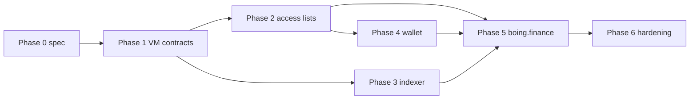

# Native AMM integration checklist (Boing L1 → wallets → boing.finance)

This is the **end-to-end** work list to go from “AMM as a pattern on paper” ([BOING-PATTERN-AMM-LIQUIDITY.md](BOING-PATTERN-AMM-LIQUIDITY.md)) to **swaps and liquidity on chain 6913** inside **boing.finance** (and partner dApps). Order is **dependency-first**; parallelizable rows are called out.

---

## Phase 0 — Freeze scope and interfaces

- [x] **A0.1** — **Frozen:** single CP pool (two reserves). **v1** bytecode is **ledger-only**; **v2** adds optional reference-token **`CALL`** after **`set_tokens`** (see [NATIVE-AMM-CALLDATA.md](NATIVE-AMM-CALLDATA.md) § Frozen MVP scope + § Selectors).
- [x] **A0.2** — **Calldata** per method documented in [NATIVE-AMM-CALLDATA.md](NATIVE-AMM-CALLDATA.md) (selectors, 128-byte words, u128 low 16 bytes).
- [x] **A0.3** — **Logs:** pool emits **`Log2`** on successful `swap` / `add_liquidity` / `remove_liquidity` — **topic0** constants + **topic1 = caller** + 96-byte **data** ([NATIVE-AMM-CALLDATA.md](NATIVE-AMM-CALLDATA.md) § Logs).
- [x] **A0.4** — **QA category** for deploy flows: use **`dapp`** / **`tooling`** (and related allowed categories) per [QUALITY-ASSURANCE-NETWORK.md](QUALITY-ASSURANCE-NETWORK.md); noted in calldata doc.
- [x] **A0.5** — Align [NATIVE-AMM-CALLDATA.md](NATIVE-AMM-CALLDATA.md) with the first pool bytecode PR (selectors, word counts); bump doc from **draft** to **v1** when merged.

---

## Phase 1 — On-chain artifacts (Boing VM)

- [x] **A1.1** — **Reference pool bytecode** in `crates/boing-execution/src/native_amm.rs` (`constant_product_pool_bytecode`): u64 reserve / amount ledger, `swap` (with **30 bps output-side fee** — [NATIVE-AMM-CALLDATA.md](NATIVE-AMM-CALLDATA.md) § Swap fee), `add_liquidity` / `remove_liquidity` with **LP share** accounting (`total_lp_supply_key`, per-signer XOR key). **VM:** **`Mul` (`0x03`)** is **256×256 → 256** (low limb; `TECHNICAL-SPECIFICATION.md` §7.2); nested **`Call` (`0xf1`)** for arbitrary contracts. **v2** pool wires reference-token **`CALL`**. **Still open:** optional fee governance / adjustable **bps** in a future pool revision.
- [x] **A1.2** — **Factory skipped for MVP:** fixed pool **`AccountId`** via config / env (see [NATIVE-AMM-CALLDATA.md](NATIVE-AMM-CALLDATA.md) § Frozen MVP scope).
- [x] **A1.3** — VM integration in `boing-execution` + **node RPC** test `native_amm_rpc_happy_path` (deploy → add → swap → remove; **`boing_getTransactionReceipt`** `logs` + **`boing_getLogs`** topic filter; reserves + **total LP**).
- [x] **A1.4** — **CI:** `constant_product_pool_bytecode_passes_protocol_qa` and v2 twin in `boing-execution`. Operators run **`boing_qaCheck`** against the **v1 or v2 line from `dump_native_amm_pool`** before production deploys.
- [x] **A1.5** — **Procedure:** pool id is **operator-published**; dApps set **`boingCanonicalTestnetPool.js`** / **`REACT_APP_BOING_NATIVE_AMM_POOL`** / `nativeConstantProductPool`. **OPS-1:** Canonical testnet hex **`0xffaa1290614441902ba813bf3bd8bf057624e0bd4f16160a9d32cd65d3f4d0c2`** is in [RPC-API-SPEC.md](RPC-API-SPEC.md) + [TESTNET.md](TESTNET.md) §5.3 ([OPS-CANONICAL-TESTNET-NATIVE-AMM-POOL.md](OPS-CANONICAL-TESTNET-NATIVE-AMM-POOL.md) § Published, **2026-04-03**). Align **boing.finance** env.

---

## Phase 2 — Access lists & simulation

- [x] **A2.1** — **Minimal access list** per tx type: table in [NATIVE-AMM-CALLDATA.md](NATIVE-AMM-CALLDATA.md) § Minimal access list by tx type.
- [x] **A2.2** — **boing.finance** passes explicit **`access_list`** `{ read/write: [sender, pool] }` on native CP `contract_call`; **`boingExpressContractCallSignSimulateSubmit`** runs **`boing_simulateTransaction`** and widens the list when **`access_list_covers_suggestion === false`**. **`boing-sdk`:** **`additionalAccountsHex32`** for **v2** pools (and any tx that **`CALL`s token contracts**); merge with simulation when the node suggests more accounts.
- [x] **A2.3** — **SDK** (`boing-sdk/src/nativeAmmPool.ts`): `buildNativeConstantProductContractCallTx`, `buildNativeConstantProductPoolAccessList`, `mergeNativePoolAccessListWithSimulation` (uses `mergeAccessListWithSimulation`).

---

## Phase 3 — RPC & indexing

- [x] **A3.1** — **`boing_getTransactionReceipt`:** `success`, `error`, `return_data`, `logs` per [RPC-API-SPEC.md](RPC-API-SPEC.md) — sufficient for failed swap diagnostics.
- [x] **A3.2** — **Canonical MVP path:** **configured pool id** + **`boing_getContractStorage`** for reserves (and optionally **total LP** / signer **LP balance** — [NATIVE-AMM-CALLDATA.md](NATIVE-AMM-CALLDATA.md) § Contract storage). **Events:** filter **`boing_getLogs`** / tx receipts by pool address + **`NATIVE_AMM_TOPIC_*`** ([NATIVE-AMM-CALLDATA.md](NATIVE-AMM-CALLDATA.md) § Logs; [Track R10](EXECUTION-PARITY-TASK-LIST.md)).
- [x] **A3.3** — **Documented default:** no separate HTTP service — use **`boing_getContractStorage`** (×2 for reserves) or JSON-RPC batch; see [NATIVE-AMM-CALLDATA.md](NATIVE-AMM-CALLDATA.md) § Pool metadata without a separate HTTP API. **Still open:** optional subgraph / REST if product needs multi-pool discovery.

---

## Phase 4 — Boing Express / wallet

- [x] **A4.1** — **Native AMM path** builds **`contract_call`** with explicit **`access_list`** (signer + pool); Express signs whatever the dApp passes — widen via simulation when the node suggests more accounts.
- [x] **A4.2** — **Wallet / dApp UX** for native CP swap: [BOING-DAPP-INTEGRATION.md](BOING-DAPP-INTEGRATION.md) § Native constant-product swap (Boing VM).
- [x] **A4.3** — **E2E smoke** (extension + dApp origin): manual procedure in [NATIVE-AMM-E2E-SMOKE.md](NATIVE-AMM-E2E-SMOKE.md) (happy-path swap + optional add liquidity). Node-level RPC coverage remains `native_amm_rpc_happy_path`. **Optional automation:** [examples/native-boing-playwright](../examples/native-boing-playwright/) (Playwright + `BOING_EXPRESS_EXTENSION_PATH`; skips when unset). Unattended extension CI remains a follow-up if product wants it.

---

## Phase 5 — boing.finance (frontend)

- [x] **A5.1** — **`contracts.js` (6913):** dedicated **`nativeConstantProductPool`** (32-byte id) + env override; foreign-chain **`dexRouter` / `dexFactory`** stay zero on native L1 until a bridged DEX exists.
- [x] **A5.2** (calldata) — **Rust + TS encoders** match [NATIVE-AMM-CALLDATA.md](NATIVE-AMM-CALLDATA.md). **Done (storage read path):** `boing-sdk` **`fetchNativeConstantProductReserves`**, **`NATIVE_CONSTANT_PRODUCT_TOTAL_LP_KEY_HEX`**, **`nativeAmmLpBalanceStorageKeyHex`**, documented keys. **Still open:** optional on-chain **view** selector (if bytecode adds explicit read methods beyond storage layout).
- [x] **A5.3** — **boing.finance:** env / `contracts.js` pool id, `NativeAmmSwapPanel` (swap + **add liquidity** `0x11`), `access_list` + **sign → simulate → merge → submit** via `boingExpressContractCallSignSimulateSubmit`, reserve reads via RPC. **OPS-1:** Set canonical hex **`0xffaa1290614441902ba813bf3bd8bf057624e0bd4f16160a9d32cd65d3f4d0c2`** in `contracts.js` / env per [OPS-CANONICAL-TESTNET-NATIVE-AMM-POOL.md](OPS-CANONICAL-TESTNET-NATIVE-AMM-POOL.md) §3 (if not already).
- [x] **A5.4** — **Quote path:** in-panel `constantProductAmountOut` from storage-loaded reserves (matches on-chain **swap** formula including **30 bps output fee**; use `constantProductAmountOutNoFee` only for diagnostics).
- [x] **A5.5** — **Swap UI:** `contract_call` via **Boing Express** `boing_sendTransaction` on chain **6913** when pool configured; foreign-chain swap paths unchanged where those networks are wired in.
- [x] **A5.6** — **Pools / Create pool / Swap:** `getFeatureSupport(...).hasNativeAmm` (from `featureSupport.js` + `nativeConstantProductPool` in `contracts.js`) hides **`NativeBoingL1IntegratedHub`** on **6913** when native pool is set; **`NativeAmmLiquidityRoutesHint`** on Create pool & Pools points users to **`/swap`**.
- [x] **A5.7** — **Error mapping:** **`formatBoingExpressRpcError`** on native AMM submit paths (QA / nested RPC `data`).

---

## Phase 6 — Hardening & launch

- [x] **A6.1** — **Property tests:** `crates/boing-execution/tests/proptest_native_amm.rs` (amount out ≤ reserve out, product invariant non-decreasing after swap). **Unit tests** assert **`Log2`** topic0 + data layout on successful swap / add / remove (`native_amm.rs`); slippage abort → **no** log.
- [x] **A6.2** — Documented in [NATIVE-AMM-CALLDATA.md](NATIVE-AMM-CALLDATA.md) § Slippage, deadline, upgrade policy.
- [x] **A6.3** — Same section + boing.finance **Native AMM** panel copy (immutable MVP).
- [x] **A6.4** — **[RPC-API-SPEC.md](RPC-API-SPEC.md)** integration note (pool id from config; `boing_getContractStorage` keys; link to calldata doc + node test). **OPS-1:** Canonical pool hex published **2026-04-03** in spec + [TESTNET.md](TESTNET.md) §5.3 ([OPS-CANONICAL-TESTNET-NATIVE-AMM-POOL.md](OPS-CANONICAL-TESTNET-NATIVE-AMM-POOL.md) § Published).

---

## Quick dependency graph

---

## Related docs

| Doc | Role |
|-----|------|
| [NATIVE-AMM-CALLDATA.md](NATIVE-AMM-CALLDATA.md) | Draft selectors + calldata layout + example hex |
| [BOING-PATTERN-AMM-LIQUIDITY.md](BOING-PATTERN-AMM-LIQUIDITY.md) | Pattern and storage/event guidance |
| [BOING-REFERENCE-TOKEN.md](BOING-REFERENCE-TOKEN.md) | Token contract interop |
| [QUALITY-ASSURANCE-NETWORK.md](QUALITY-ASSURANCE-NETWORK.md) | Deploy QA categories |
| [EXECUTION-PARITY-TASK-LIST.md](EXECUTION-PARITY-TASK-LIST.md) | VM / receipts / logs foundation |
| [NATIVE-AMM-E2E-SMOKE.md](NATIVE-AMM-E2E-SMOKE.md) | Manual Boing Express + boing.finance swap smoke (**A4.3**) |
| [OPS-CANONICAL-TESTNET-NATIVE-AMM-POOL.md](OPS-CANONICAL-TESTNET-NATIVE-AMM-POOL.md) | **OPS-1** published (**2026-04-03**); checklist for **future** pool rotations |

---

## Suggested next concrete artifact

**Calldata + bytecode:** [NATIVE-AMM-CALLDATA.md](NATIVE-AMM-CALLDATA.md). **Done in-repo:** **NAMM-1**–**3** (LP, fee, **`Log2`**) + **NAMM-4** (**v2** token `CALL`s, **`set_tokens`**, **`NATIVE_CP_POOL_CREATE2_SALT_V2`**). **Next:** **OPS-1** hex is live (**v1** pool **`0xffaa…d0c2`**); keep **boing.finance** in sync. **E2E-1:** [examples/native-boing-playwright](../examples/native-boing-playwright/). Indexers: **`nativeAmmLogs`** + **`boing_getLogs`**. RPC coverage: `native_amm_rpc_happy_path`.
