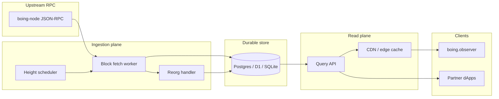

# Hosted observer / indexer service (OBS-1)

**Status:** Architecture and operations spec. **boing.observer** today can be a **static frontend + public JSON-RPC** (no durable backend). This document describes the **next layer**: a long-running **ingestion + storage + query** stack that powers fast search, stable deep links, and reorg-safe history without hammering the validator RPC for every page view.

**Related:** [INDEXER-RECEIPT-AND-LOG-INGESTION.md](INDEXER-RECEIPT-AND-LOG-INGESTION.md) (replay loop, SDK helpers, pruned nodes), [BOING-OBSERVER-AND-EXPRESS.md](BOING-OBSERVER-AND-EXPRESS.md) (explorer UX), [RPC-API-SPEC.md](RPC-API-SPEC.md) (methods and caps), [TESTNET-OPS-RUNBOOK.md](TESTNET-OPS-RUNBOOK.md) §3 (`observer-chain-tip-poll` interim).

---

## 1. Problem statement

| Today | Gap |
|-------|-----|
| Explorer calls **RPC** for each view | No shared cache; rate limits and latency hit UX at scale |
| Tutorial scripts (`fetch-blocks-range`, `indexer-ingest-tick`, `observer-chain-tip-poll`) | Ephemeral cursors; not a multi-tenant product |
| `boing_getLogs` | Bounded shortcut; not a substitute for durable block replay ([INDEXER-RECEIPT-AND-LOG-INGESTION.md](INDEXER-RECEIPT-AND-LOG-INGESTION.md)) |

**Hosted observer (OBS-1)** means: **persist** canonical chain data your product cares about, **advance** it deterministically behind a finality rule, **rewind** on reorgs, and **serve** read APIs (or static builds) to **boing.observer** and partners.

---

## 2. Scope

**In scope**

- Block + transaction + receipt (+ log row) ingestion from **`boing_getBlockByHeight(..., true)`** as primary source.
- Cursor and **reorg** handling using block **parent hash** / height continuity.
- **Finality-aware** lag: index at or behind **`boing_getSyncState` → `finalized_height`** (or documented policy — see [RPC-API-SPEC.md](RPC-API-SPEC.md)).
- Read path: HTTP JSON (or GraphQL) for explorer; optional **edge cache** for hot keys (block by height, tx by id).
- Operations: backoff on RPC errors, idempotent upserts, metrics, alerts.

**Out of scope (unless product explicitly expands)**

- Running a **validator** or **archive node** (ingestion depends on **someone else’s** full RPC).
- **Trustless** light-client verification of every field (explorer trusts RPC; detect anomalies via hash continuity + optional cross-checks).
- **Multi-pool discovery** without logs / configured addresses ([NATIVE-AMM-INTEGRATION-CHECKLIST.md](NATIVE-AMM-INTEGRATION-CHECKLIST.md) A3.3).

---

## 3. High-level architecture



- **Single-writer** ingestion (one logical process owning the cursor) avoids fork races; scale **read** replicas horizontally.
- **Fetcher** should batch heights conservatively (respect **`boing_getLogs`** / block payload caps on the upstream).

---

## 4. Data model (minimal)

Tables are illustrative; adjust types for your SQL engine.

| Table | Purpose |
|-------|---------|
| **`ingest_cursor`** | `chain_id`, `last_committed_height`, `last_committed_block_hash`, `updated_at` |
| **`block_height_gaps`** | Inclusive pruned / missing ranges per `chain_id` (`from_height`, `to_height`, `reason`); merge overlaps with **`boing-sdk`** **`mergeInclusiveHeightRanges`** before upsert |
| **`blocks`** | `height` (PK), `block_hash`, `parent_hash`, `timestamp` (if exposed), raw header fields you need |
| **`transactions`** | `tx_id` (PK), `block_height`, `tx_index`, `sender`, `payload_kind`, optional `raw_hex` |
| **`receipts`** | `tx_id` (PK), `success`, `gas_used`, `return_data` (bounded), `error` |
| **`logs`** | `id` (surrogate), `tx_id`, `log_index`, `address` (contract), `topics_json`, `data_hex` |

**Indexes:** `blocks(parent_hash)`, `transactions(block_height, tx_index)`, `logs(address)`, GIN/JSON on topics if you filter NAMM-style topics ([NATIVE-AMM-CALLDATA.md](NATIVE-AMM-CALLDATA.md) § Logs).

**Optional later:** `accounts` snapshot table (heavy), contract code cache, native AMM reserve snapshots for charts.

**Reference DDL (SQLite / D1):** [`tools/observer-indexer-schema.sql`](../tools/observer-indexer-schema.sql) — includes **`ingest_cursor`**, **`block_height_gaps`**, and minimal **`blocks` / `transactions` / `receipts` / `logs`** stubs. Contiguous cursor policy: **`nextContiguousIndexedHeightAfterOmittedFetch`** in **`boing-sdk`** after **`summarizeIndexerFetchGaps`**.

**Reference loop (JSON file, no DB):** [`examples/observer-ingest-reference`](../examples/observer-ingest-reference/) — **`npm run ingest-tick`** persists **`lastIndexedHeight`** + **`gapRanges`**; **`npm run ingest-sqlite-tick`** + **`BOING_SQLITE_PATH`** fills the full SQL schema locally (**`node:sqlite`**, Node 22+); both support **`BOING_GAP_CLEAR_*`** via **`subtractInclusiveRangeFromRanges`**.

**Scheduled Worker + D1:** [`examples/observer-d1-worker`](../examples/observer-d1-worker/) — cron ingest using the same tables (migrations add **`idx_blocks_hash`** for hash lookups); read API includes **`GET /api/readiness`** (**200** when D1 answers, RPC tips resolve via **`planIndexerChainTipsWithFallback`**, and optional **`BOING_READINESS_MAX_LAG_FINALIZED`** is not exceeded once the cursor exists; **503** otherwise — suitable for synthetic probes), **`/api/tip`**, **`/api/gaps`**, **`/api/blocks/recent`**, batched **`/api/transactions/batch`** / **`/api/receipts/batch`**, **HEAD** on block / tx / receipt, and **reorg rewind** (compare **`boing_getBlockByHeight(h, false)`** to D1 from the cursor tip downward, delete mismatched heights, then extend; configurable via **`BOING_MAX_REORG_REWIND_STEPS`** / **`BOING_DISABLE_REORG_REWIND`**). Ingest **`action: 'fetch'`** logs include **`tipsSource`**, **`headHeight`**, **`finalizedHeight`**, **`durableIndexThrough`** (same semantics as **`boing-sdk`** **`planIndexerCatchUp`** — indexing is capped at **`min(head, finalized)`**). Read paths include **`GET /ingest-status`**, **`GET /api/version`**, **`GET /api/sync`** (RPC tip vs cursor + **`lagVsRpcHead`** / **`lagVsFinalized`**), **`GET /api/stats`**, **`GET /api/block`**, **`GET /api/blocks`**, **`GET /api/transaction`**, **`GET /api/receipt`**, **`GET /api/logs`** (optional **`address`** / **`topic0`…`topic3`** filters; log rows persist **`address`** when the node supplies it on receipt logs), **`GET /api/txs`**; set a public **`BOING_RPC_URL`** for production. Optional **`BOING_READ_CACHE_MAX_AGE`** (positive seconds, capped at **86400**) sets **`Cache-Control: public, max-age=…`** on **200** single block / tx / receipt and batch tx/receipt responses to help a CDN or browser cache the read plane (readiness / sync / lists / logs stay **`no-store`**).

---

## 5. Ingestion loop (normative)

**Catch-up (how the indexer reaches the tip):** A scheduler (e.g. Cloudflare **cron** every few minutes) runs one **tick**. Each tick calls **`boing-sdk`** **`planIndexerCatchUp`**, which reads **`boing_getSyncState`** (or **`boing_chainHeight`** + tip block if sync state is missing) and plans an inclusive height range up to **`min(head_height, finalized_height)`**, capped by **`maxBlocksPerTick`**. The worker fetches **`boing_getBlockByHeight(h, true)`** for those heights (plus reorg rewind when headers disagree with D1), persists blocks / txs / receipts / logs, then advances **`ingest_cursor`**. Repeating ticks drain the backlog until **`planIndexerCatchUp`** returns nothing (**idle**). Pruned RPCs use **`onMissingBlock: 'omit'`** and gap rows; see [INDEXER-RECEIPT-AND-LOG-INGESTION.md](INDEXER-RECEIPT-AND-LOG-INGESTION.md).

Align with [INDEXER-RECEIPT-AND-LOG-INGESTION.md](INDEXER-RECEIPT-AND-LOG-INGESTION.md) § **Ingestion loop**.

1. Load **`ingest_cursor`**.
2. Read **`H_head`** = `boing_chainHeight` and **`H_final`** from `boing_getSyncState` (use **`finalized_height`** or stricter policy).
3. Target **`H_target = min(H_head, H_final)`** if you only durable-index finalized; otherwise document the risk of showing uncled blocks.
4. For `h` in `(last_committed_height, H_target]`:
   - Fetch **`boing_getBlockByHeight(h, true)`**.
   - If **`parent_hash`** of block `h` does not match stored hash of `h-1`, trigger **§6 Reorg** instead of commit.
   - Upsert **block**, **txs**, **receipts**, **logs** in one transaction (application DB transaction).
5. Update **`ingest_cursor`**.

**Idempotency:** `ON CONFLICT DO UPDATE` on natural keys (`tx_id`, `(block_height, tx_index)`).

**Pruned / missing blocks:** [INDEXER-RECEIPT-AND-LOG-INGESTION.md](INDEXER-RECEIPT-AND-LOG-INGESTION.md) § **Pruned nodes and missing blocks** — track gaps; do not pretend pruned history exists.

---

## 6. Reorgs

When **`parent_hash`** disagrees with your stored chain:

1. **Freeze** public reads at `last_safe_height` (optional) or serve with `stale` header — product choice.
2. **Walk back** from tip: delete (or tombstone) blocks `h, h-1, …` until you find a common ancestor hash matching RPC’s block at that height.
3. **Replay forward** from that height to the new tip.

**In-repo D1 worker:** [`examples/observer-d1-worker/src/reorg-rewind.ts`](../examples/observer-d1-worker/src/reorg-rewind.ts) implements the walk-back delete against D1; the ingest tick also **aborts** if the first fetched block’s **`parent_hash`** does not match the post-rewind cursor (avoids persisting an orphan segment; the next cron retries after rewind).

Keep a **short retention** of replaced rows in a **`blocks_orphaned`** table if you need audit/debug (optional).

---

## 7. Read API (explorer-facing)

Minimal routes (examples):

- `GET /v1/blocks/latest`, `GET /v1/blocks/{height}`
- `GET /v1/tx/{tx_id}` → block + index + receipt summary
- `GET /v1/accounts/{id}/txs?cursor=` (if you index senders)
- `GET /v1/logs?fromHeight=&toHeight=&address=&topic0=` — **enforce** the same bounded windows as RPC or stricter to protect your DB.

**Auth:** public read; **separate** internal admin for backfill/replay. Do **not** expose operator RPC secrets to the browser.

---

## 8. Deployment patterns

| Pattern | When | Notes |
|---------|------|--------|
| **Single VM + Postgres** | Testnet, early mainnet | Simplest ops; use connection pooling |
| **Worker + D1 + Queue** | Cloudflare stack | Good for global edge reads; watch D1 write throughput and migration story |
| **Kubernetes + managed SQL** | High traffic | HPA on read API; single ingest Deployment |

**Secrets:** RPC URL (and optional API key) in env / vault. **Rotate** without redeploying explorer static assets.

**Observability:** metrics — `last_committed_height`, `lag_behind_final`, `rpc_errors_total`, `reorg_events_total`, ingest latency histograms. The in-repo D1 worker exposes **`GET /api/readiness`** (and **`/api/sync`**) for coarse **`lag_vs_finalized`**; wire your monitor to **503** on readiness when **`BOING_READINESS_MAX_LAG_FINALIZED`** is set.

### 8.1 Uptime and synthetic checks (D1 Worker)

| Probe | Path | When to use |
|-------|------|-------------|
| **Liveness** (process up) | **`GET /health`** | Cheap “is the Worker running?” only. Does **not** touch D1 or RPC. |
| **Readiness** (DB + RPC + optional lag) | **`GET /api/readiness`** or **`HEAD /api/readiness`** | **Preferred** for uptime SaaS, Cloudflare **Health Checks**, and cron probes. Returns **503** when D1 is unreachable, RPC tips cannot be read, or (if configured) indexer lag vs finalized is too high. |

**`BOING_READINESS_MAX_LAG_FINALIZED`** and **auto-arm (in-repo D1 worker)**

- The worker persists **`ingest_cursor.readiness_lag_guard_armed`** (migration **`0003_readiness_lag_guard_armed.sql`**). While **`armed = 0`**, **`/api/readiness`** does **not** fail on lag — D1 + RPC must still succeed — so **backfill does not flip monitors red**.
- After each successful tick (**fetch** or **idle**), if **`BOING_READINESS_MAX_LAG_FINALIZED`** is set and **`armed = 0`**, the worker sets **`armed = 1`** when **`finalized_height − last_committed_height ≤ BOING_READINESS_ARM_WHEN_LAG_LTE`** (default **128** in code if env unset). From then on, lag above **`BOING_READINESS_MAX_LAG_FINALIZED`** yields **503**.
- **Tuning:** Set **`BOING_READINESS_MAX_LAG_FINALIZED`** to roughly **2× p99** of **`lagVsFinalized`** in steady state (see **`GET /api/sync`**). Set **`BOING_READINESS_ARM_WHEN_LAG_LTE`** slightly above the lag you expect right before “caught up” (must be **≥** typical steady lag or the guard may never arm).
- **Unset `BOING_READINESS_MAX_LAG_FINALIZED`:** No lag-based **503**; D1 + RPC checks only.
- **Reset after disaster:** SQL **`UPDATE ingest_cursor SET readiness_lag_guard_armed = 0`** for the chain, redeploy or wait for the next auto-arm after catch-up again.

**Repo helper (CI / shell):** from the monorepo root, after deploy:

```bash
npm run check-observer-readiness -- https://your-worker.workers.dev
# Bandwidth-only probe (status line only):
BOING_OBSERVER_USE_HEAD=1 npm run check-observer-readiness -- https://your-worker.workers.dev
```

---

## 9. Milestones (suggested)

| Milestone | Deliverable |
|-----------|-------------|
| **M0** | Ingest **finalized** heights only; Postgres schema; CLI worker in a private repo or monorepo package |
| **M1** | Reorg rewind + integration tests with mocked RPC |
| **M2** | HTTP read API + boing.observer switched from “RPC everywhere” to “API for list/detail” |
| **M3** | Log search + NAMM topic filters; rate limit + cache |

---

## 10. Relationship to interim tooling

- **`npm run observer-chain-tip-poll`** — health / stall detection only; **no** persistence ([observer-chain-tip-poll.mjs](../examples/native-boing-tutorial/scripts/observer-chain-tip-poll.mjs)).
- **`indexer-ingest-tick`** — planning + optional fetch demo; **not** a hosted service ([indexer-ingest-tick.mjs](../examples/native-boing-tutorial/scripts/indexer-ingest-tick.mjs)).

When OBS-1 ships, keep the poll script for **SRE dashboards**; replace ad-hoc fetch scripts with the **durable worker** described above.

---

## 11. Open decisions (product)

- **Finalized vs head:** show head blocks in UI with “pending” badge vs only finalized (aligns with [EXECUTION-PARITY-TASK-LIST.md](EXECUTION-PARITY-TASK-LIST.md) Track **X** wording).
- **Retention:** full history vs sliding window (cost).
- **Account history:** full trace indexing vs “latest balance from RPC” hybrid.

Document choices in **boing.observer** `/about` or operator runbook once decided.
